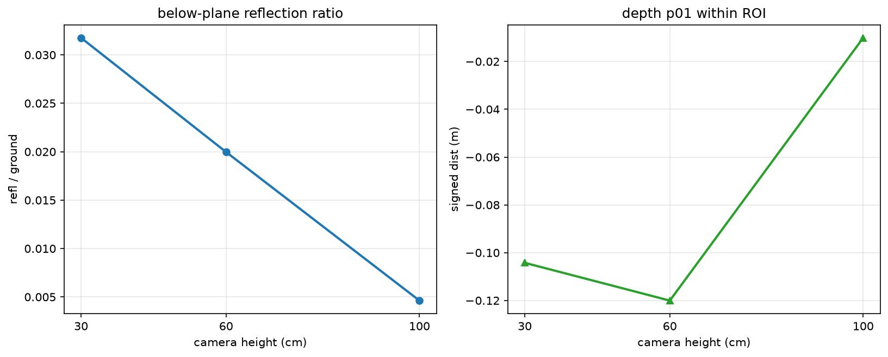
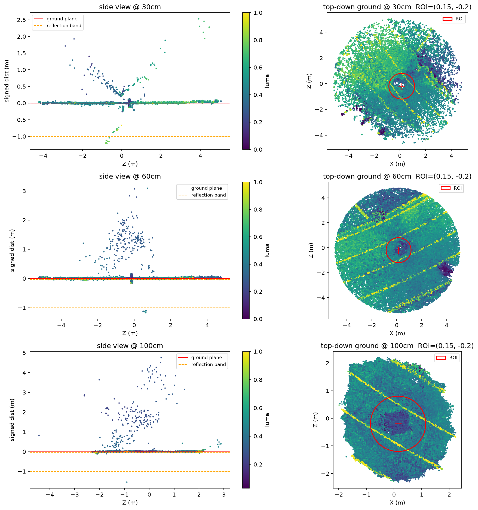
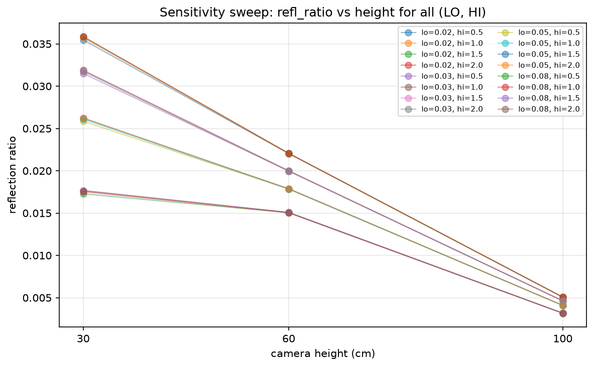

# Camera-Height Effects on Wet-Road Reflection Artifacts in 3DGS

Do wet-road reflection artifacts in **3D Gaussian Splatting** reconstructions depend
on the **camera height** used to capture the scene? This project tests that on three
real scans I captured myself.

## Motivation
Wet surfaces produce mirror-like reflections. When a scene is reconstructed with 3DGS
(here, exported from **Scaniverse**), those reflections can be "baked in" as ghost
geometry *below* the road surface. If the amount of this artifact depends on camera
height, that is useful to know for anyone capturing outdoor scenes for robotics /
vision datasets.

**Hypothesis:** the lower the camera, the more below-surface reflection is reconstructed.

## Data
Three scans of the **same** wet-road scene (a puddle with a can beside it), differing
**only** in camera height: ~30 cm, ~60 cm, ~100 cm. The large `.ply` files are not
committed — see [`data/README.md`](data/README.md).

## Method
1. Load each Scaniverse PLY and crop distant points (median-centered radius).
2. Estimate the road plane with **RANSAC**, then refit on inliers via **SVD**.
3. Compute each point's **signed distance** to the plane.
4. Restrict to the puddle **ROI** (per-scan center, since each scan has its own frame).
5. Count **below-plane ghost points** and normalize by ground points → `refl_ratio`.
   Raw counts (`n_refl`) are reported too, so the trend is not just a denominator effect.
6. **Sanity-check** scale/coordinates and ghost location across all three scans.
7. **Threshold sensitivity:** sweep the below-plane band (`REFL_LO` × `REFL_HI`) and
   check whether the height ordering is preserved.

## Results

Below-plane reflection artifacts, measured inside the puddle ROI:

| Camera height | `refl_ratio` | `n_refl` (raw) | ground pts |
|---|---|---|---|
| 30 cm  | 0.0318 | 4 388 | 138 155 |
| 60 cm  | 0.0200 | 3 657 | 183 155 |
| 100 cm | 0.0046 | 1 241 | 268 430 |

- The artifact **decreases monotonically** with camera height — about a **7× drop**
  from 30 cm to 100 cm. In the 30 cm side view a clear downward reflection tail is
  visible below the road plane; it is far sparser at 60/100 cm.
- The trend holds in **raw counts**, not only in the normalized ratio.
- It is **robust to the ROI choice**: without the ROI (whole crop) the ratios are
  0.0625 / 0.0225 / 0.0065 — same ordering, same direction.
- **Sensitivity:** across a 4×4 grid of below-plane thresholds, the
  `30 cm > 60 cm > 100 cm` ordering held in **16/16** combinations — the trend is not an
  artifact of one tuning (it does not claim the absolute values are threshold-independent).





## Limitations
- No dry-road control scan; the claim is about **relative** height dependence.
- **Scan coverage differs** (the 30/60 cm scans span ≈10 m, the 100 cm scan ≈6 m), and
  each Scaniverse export has its **own coordinate frame**, so the puddle ROI is only
  *approximately* registered across scans — the comparison is suggestive, not a fully
  controlled experiment. (Lane-marking spacing looks consistent at ≈2 m, so scale is
  broadly comparable.)
- Absolute depths (e.g. `depth_p01`) can be influenced by outliers; they are computed
  inside the ROI to reduce this, but should be read qualitatively.
- The result's strength is its **direction and robustness** (ROI on/off, 16/16 threshold
  settings), not the exact ratio values.

## Repository layout
```
scaniverse-3dgs-project/
├─ README.md
├─ requirements.txt
├─ .gitignore
├─ notebooks/
│  └─ wet_road_reflection_analysis.ipynb   # main analysis
├─ src/
│  └─ topdown_view.py      # helper: top-down view / can-center picker
├─ docs/
│  └─ wet_road_3dgs.pdf    # background write-up (physics + experiment design)
├─ data/
│  └─ README.md            # how to place the (git-ignored) PLY files
└─ results/                # exported figures used above
```

## Reproduce
```bash
pip install -r requirements.txt
# place low.ply / middle.ply / high.ply under data/raw/  (see data/README.md)
jupyter lab notebooks/wet_road_reflection_analysis.ipynb
```
Run the CONFIG cell and the `fit_plane` cell first, then the sanity-check cell
(verify ROI), then the results / sensitivity cells.
