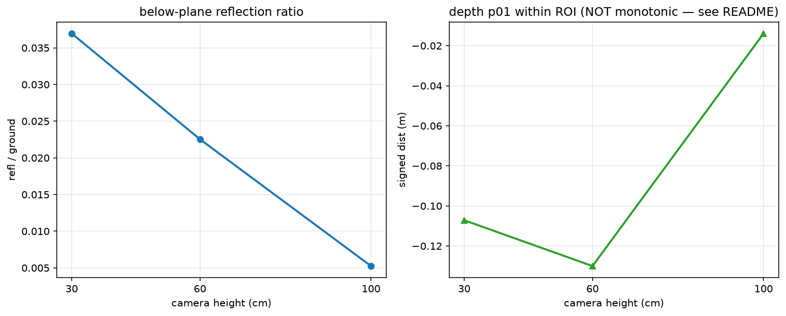
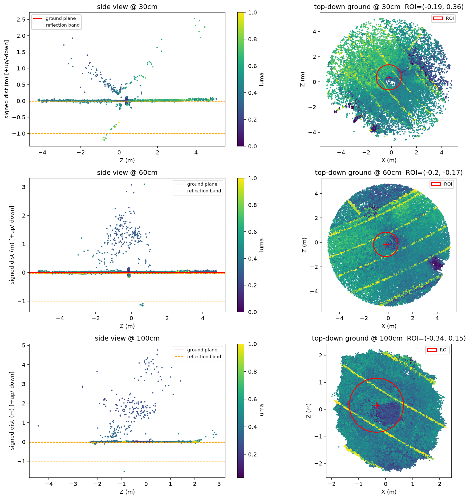
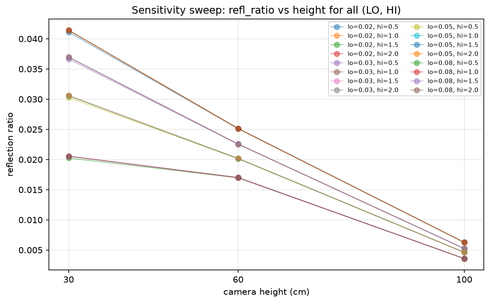
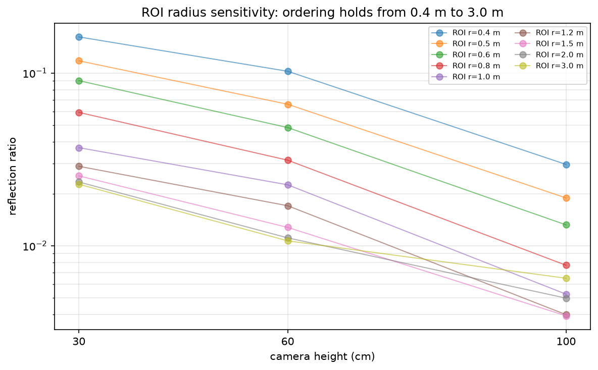

# Camera-Height Effects on Wet-Road Reflection Artifacts in 3DGS

Do wet-road reflection artifacts in **3D Gaussian Splatting** reconstructions depend
on the **camera height** used to capture the scene? This project tests that on three
real scans I captured myself.

## Motivation
Wet surfaces produce mirror-like reflections. When a scene is reconstructed with 3DGS
(here, exported from **Scaniverse**), those reflections can be "baked in" as ghost
geometry *below* the road surface. If the amount of this artifact depends on camera
height, that is useful to know for anyone capturing outdoor scenes for robotics /
vision datasets.

**Hypothesis:** the lower the camera, the more below-surface reflection is reconstructed.

## Data
Three scans of the **same** wet-road scene (a puddle with a can beside it), differing
**only** in camera height: ~30 cm, ~60 cm, ~100 cm. The large `.ply` files are not
committed — see [`data/README.md`](data/README.md).

## Method
1. Load each Scaniverse PLY and crop distant points (median-centered radius).
2. Estimate the road plane with **RANSAC**, then refit on inliers via **SVD**.
3. Compute each point's **signed distance** to the plane.
4. Restrict to an **ROI around the reflected object** (a can standing in the puddle).
   Each Scaniverse export has its own coordinate frame, so a single shared ROI center
   would be misregistered by 0.3–0.7 m; the center is therefore **detected per scan**
   as the density peak of points *above* the plane (+5…40 cm). Since the metric counts
   points *below* the plane, the anchor is independent of what is being measured.
5. Count **below-plane ghost points** and normalize by ground points → `refl_ratio`.
   Raw counts (`n_refl`) are reported too, so the trend is not just a denominator effect.
6. **Sanity-check** scale/coordinates and ghost location across all three scans, and
   verify the mirror geometry (a can of height *+h* should cast its image at *−h*).
7. **Sensitivity:** sweep the below-plane band (`REFL_LO` × `REFL_HI`) *and* the ROI
   radius, and check whether the height ordering is preserved.

## Results

Below-plane reflection artifacts, measured inside the ROI (radius 1.0 m):

| Camera height | `refl_ratio` | `n_refl` (raw) | ground pts | `depth_p01` |
|---|---|---|---|---|
| 30 cm  | 0.0370 | 4 359 | 117 950 | −0.107 m |
| 60 cm  | 0.0225 | 3 658 | 162 365 | −0.130 m |
| 100 cm | 0.0052 | 1 247 | 237 783 | −0.014 m |

- **How often** artifacts occur decreases monotonically with camera height — about a
  **7× drop** from 30 cm to 100 cm. In the 30 cm side view a clear downward reflection
  tail is visible below the road plane; it is far sparser at 60/100 cm.
- The trend holds in **raw counts**, not only in the normalized ratio.
- The below-plane points are **really the can's mirror image**, not reconstruction noise.
  In every scan the ghost cluster sits directly under the can, and its depth matches the
  can's reconstructed height to within 1 cm — exactly the *+h → −h* geometry of a mirror:

  | Camera height | can height (p50) | ghost depth (median) | difference |
  |---|---|---|---|
  | 30 cm  | 0.087 m | 0.085 m | 0.002 m |
  | 60 cm  | 0.133 m | 0.122 m | 0.010 m |
  | 100 cm | 0.112 m | 0.104 m | 0.008 m |

- **How deep** they go does *not* follow the same pattern: `depth_p01` is deeper at
  60 cm (−0.130 m) than at 30 cm (−0.107 m). This is expected rather than a failure —
  the depth of a mirror image is set by the **height of the reflected object**, a scene
  property, not by camera height. Camera height changes **how much** of the image is
  reconstructed, not **how deep** it sits. So the result supports a height effect on the
  **frequency** of below-plane artifacts, not on their depth; the original hypothesis
  ("lower camera → more *and* deeper artifacts") is only half supported, and the depth
  half was never a well-posed prediction.
- **Threshold sensitivity:** across a 4×4 grid of below-plane thresholds, the
  `30 cm > 60 cm > 100 cm` ordering held in **16/16** combinations.
- **ROI sensitivity:** the ordering also held at **9/9** ROI radii from 0.4 m to 3.0 m
  (a 7.5× range); the 30/100 multiplier moves between 3.5× and 7.7× over that range.
  So the *direction* is robust and the *magnitude* is radius-dependent — the trend is
  not an artifact of one tuning, but the exact ratio should not be quoted precisely.
- Dropping the ROI entirely (whole crop) gives 0.0625 / 0.0225 / 0.0065 — same ordering,
  same direction.






## Limitations
- No dry-road control scan; the claim is about **relative** height dependence.
- **Scan coverage differs** (the 30/60 cm scans span ≈10 m, the 100 cm scan ≈6 m), and
  each Scaniverse export has its **own coordinate frame**. The ROI is registered per scan
  via the can anchor, but there is no rigid alignment between the three point clouds, so
  this is a controlled *comparison*, not a co-registered one.
- **Scale is not identical across scans.** The same physical can is reconstructed
  8.7 / 13.3 / 11.2 cm tall, implying roughly ±25 % scale spread between exports. The
  threshold sweep (2–8 cm × 0.5–2 m) and the ROI radius sweep (0.4–3.0 m, a 7.5× range)
  both span far more than that, so a 25 % scale error cannot flip the ordering — but
  absolute values inherit this uncertainty.
- Absolute depths (e.g. `depth_p01`) can be influenced by outliers; they are computed
  inside the ROI to reduce this, but should be read qualitatively.
- The result's strength is its **direction and robustness** (16/16 threshold settings,
  9/9 ROI radii, ROI on/off) plus the mirror-geometry check, not the exact ratio values.

## Repository layout
```
scaniverse-3dgs-project/
├─ README.md
├─ requirements.txt
├─ .gitignore
├─ notebooks/
│  └─ wet_road_reflection_analysis.ipynb   # main analysis
├─ src/
│  └─ topdown_view.py      # helper: top-down view / can-center picker
├─ docs/
│  ├─ PPT.pdf              # slide deck presenting the study and its results
│  └─ initial_experiment_design.pdf
│     # initial proposal (physics rationale; planned 6 dry/wet scans via Open3D).
│     # The final implementation analyses 3 wet-road scans with plyfile — see Results.
├─ data/
│  └─ README.md            # how to place the (git-ignored) PLY files
└─ results/                # exported figures used above
```

## Reproduce
```bash
pip install -r requirements.txt
# place low.ply / middle.ply / high.ply under data/raw/  (see data/README.md)
jupyter lab notebooks/wet_road_reflection_analysis.ipynb
```
Run the CONFIG cell and the `fit_plane` cell first, then the **ROI anchor** cell (it
detects the per-scan ROI center and prints the mirror-geometry check), then the results
and sensitivity cells. The sanity-check cell draws the ROI circle on a top-down view so
the registration can be confirmed by eye.

The scans are cached in memory after first load (`_SCAN_CACHE`), so the sweep cells do
not re-read the ~125 MB PLY files on every combination.
